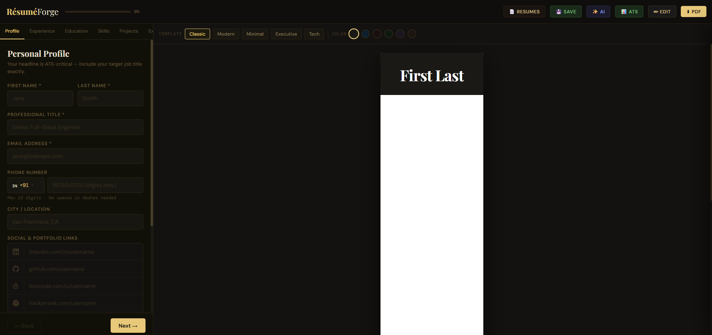

<div align="center">

# ✦ BuildMyCV — ResuméForge

### AI-Powered Resume Builder for Modern Professionals

[](https://resumeforge-gamma.vercel.app/)


Create **ATS-optimized resumes instantly** using AI, modern templates, and real-time preview editing.

</div>

---

# 🚀 Live Demo

🔗 **Try the application here**

https://resumeforge-gamma.vercel.app/

Build professional resumes with:

• AI writing assistant
• ATS optimization
• Multiple resume templates
• Instant PDF export

---

# 📸 Screenshots

### Resume Editor



### Recent Resumes


### AI Assistant


### ATS Score Panel


---

# ✨ Features

## 🎨 Multiple Professional Templates

Choose from **five professionally designed templates**:

| Template  | Best For                      |
| --------- | ----------------------------- |
| Classic   | Corporate and finance roles   |
| Modern    | Creative industries           |
| Minimal   | Academic and research resumes |
| Executive | Leadership roles              |
| Tech      | Software engineering resumes  |

Templates can be switched instantly without losing data.

---

# 🤖 AI Resume Writing Assistant

Integrated **AI tools powered by DeepSeek** help users improve resume content.

Capabilities include:

• Generate professional summary
• Improve resume bullet points
• Suggest relevant skills
• Enhance existing content
• Tailor resume to job descriptions
• Generate cover letter introduction

This helps transform raw content into **impactful, ATS-ready resumes**.

---

# 🎯 ATS Optimization System

The built-in **ATS analyzer** ensures resumes pass automated screening tools used by recruiters.

Users can paste a job description and receive:

• Keyword optimization suggestions
• Missing skills detection
• Title improvements
• Resume structure recommendations
• Detailed ATS score report

---

# ✏️ Live Resume Editor

The application features **split-screen editing**.

Left side → Resume form
Right side → Live preview

Users can also edit content directly inside the preview.

---

# 📄 One-Click PDF Export

Export resumes instantly as high-quality PDFs.

Powered by:

• **html2canvas**
• **jsPDF**

Users can choose custom file names before downloading.

---

# 💾 Resume Manager

Users can manage multiple resumes locally.

Features include:

• Save multiple resumes
• Load previous resumes
• Duplicate resumes
• Delete unused resumes

All data is stored in **browser localStorage**.

---

# 🧠 Tech Stack

| Layer            | Technology          |
| ---------------- | ------------------- |
| Frontend         | React 18            |
| Build Tool       | Vite                |
| State Management | Zustand             |
| AI Integration   | DeepSeek API        |
| PDF Generation   | html2canvas + jsPDF |
| Styling          | CSS                 |

---

# 🏗 Project Architecture

```
src
 ├── App.jsx
 ├── components
 │   ├── templates
 │   ├── panels
 │   │   ├── AIPanel.jsx
 │   │   ├── ATSPanel.jsx
 │   │   └── RecentResumes.jsx
 │   └── form
 │       └── FormSteps.jsx
 ├── hooks
 │   ├── useResumeStore.js
 │   └── useAI.js
 └── utils
     ├── ai.js
     ├── ats.js
     ├── pdf.js
     └── constants.js
```

---

# ⚙️ Installation

Clone the repository:

```
git clone https://github.com/nikhilpowar09/BuildMyCV.git
cd BuildMyCV/resumeforge
```

Install dependencies:

```
npm install
```

Create environment configuration file:

```
.env.local
```

Add your API key:

```
VITE_DEEPSEEK_API_KEY=your_api_key
```

Run the development server:

```
npm run dev
```

Open the application at:

```
http://localhost:5173
```

---

# 🏭 Production Build

Build the application:

```
npm run build
```

Preview production build:

```
npm run preview
```

---

# 🔐 Environment Variables

| Variable              | Description                  |
| --------------------- | ---------------------------- |
| VITE_DEEPSEEK_API_KEY | API key used for AI features |

You can obtain a free API key from:

https://platform.deepseek.com/api-keys

---

# ⚠️ Security Note

Since the application runs fully in the browser, the API key is bundled with the client.

For production use, AI requests should be **proxied through a backend server** to protect the API key.

---

# 🛣 Roadmap

Future improvements planned:

• TypeScript migration
• Backend proxy for API security
• Cover letter generator
• Dark / light theme
• Drag-and-drop section ordering
• LinkedIn resume import

---

# 📄 License

You are free to use, modify, and distribute this project.

---

<div align="center">

Built with ❤️ using **React, Vite, Zustand, and AI**

</div>
